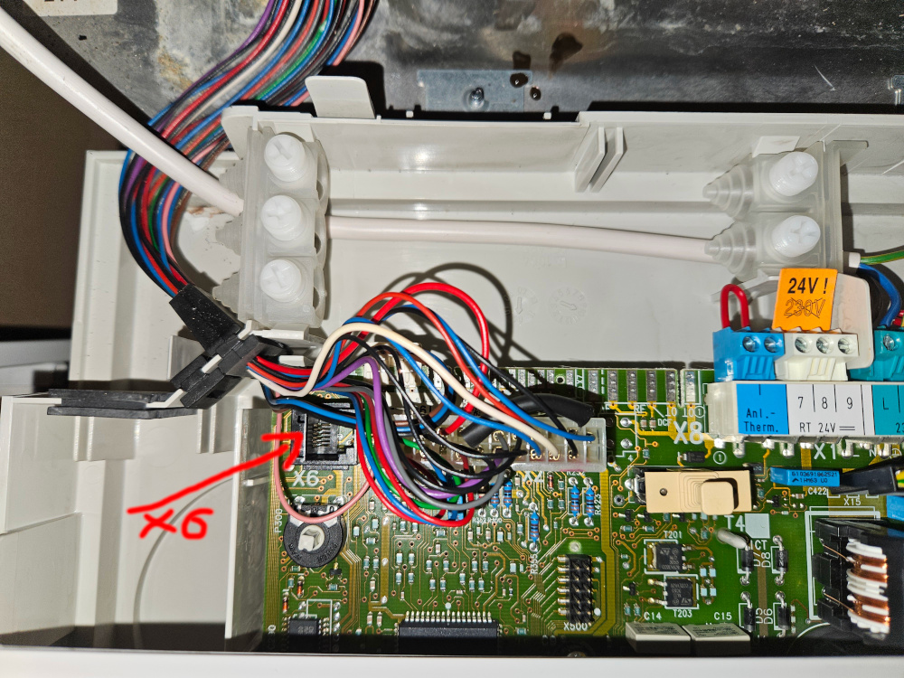
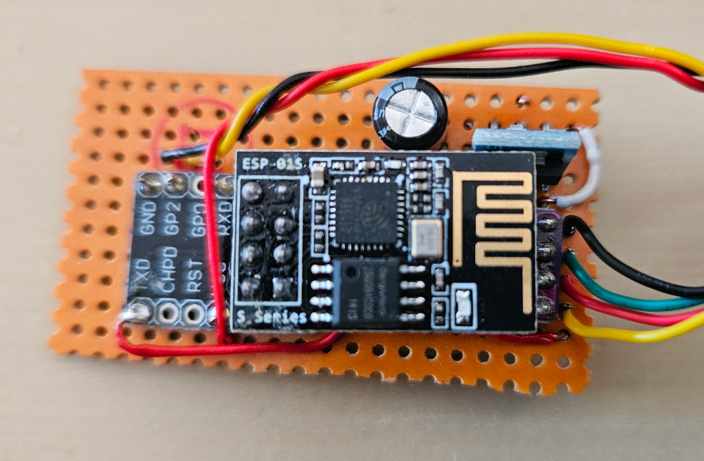
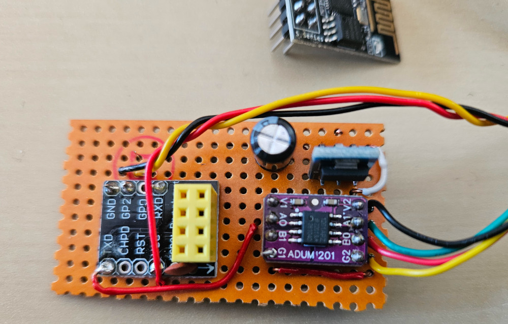
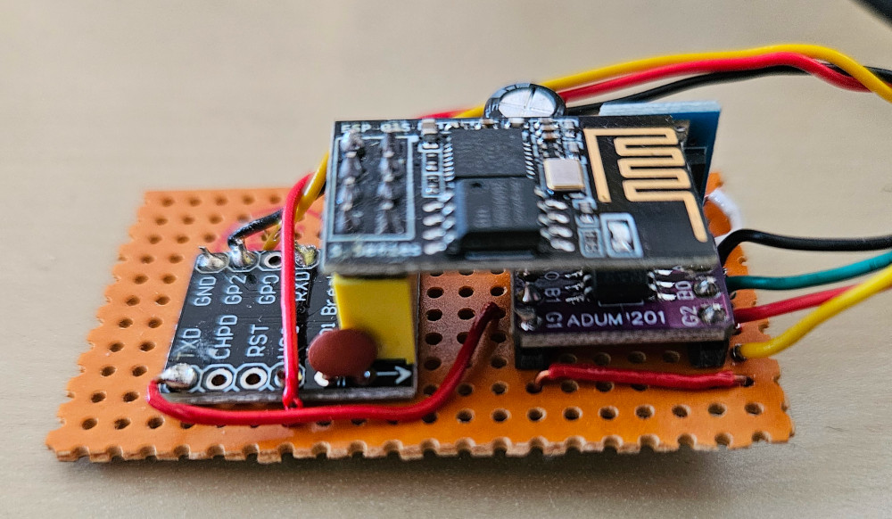

# esphome-vaillant-x6  

ESPHome component for Vaillant heating boilers with the X6 interface.  
This is a fork from ulich/esphome-vaillant-x6 (thank you)

## Overview  

This ESPHome component allows you to read various operational parameters from Vaillant heating boilers equipped with the **X6 interface**. The component communicates with the boiler via UART and can be integrated into Home Assistant.  


## Features  

Continuously reads the following sensor values from the boiler and sends them to Home Assistant:

| Sensor                                               | Interval |
|------------------------------------------------------|----------|
| **Actual Flow Temperature**                          | 10s      |
| **Target Flow Temperature**                          | 60s      |
| **Target Flow Temperature based on room thermostat** | 60s      |
| **Return Flow Temperature**                          | 10s      |
| **Outside Temperature**                              | 60s      |
| **Burner Status (On/Off)**                           | 10s      |
| **Circulating Pump Status (On/Off)**                 | 10s      |
| **Gas Valve (On/Off)**                               | 10s      |
| **Summer Winter State**                              | 60s      |
| **Hot Water Target Temperature**                     | 60s      |
| **Hot Water Temperature**                            | 30s      |


## Installation  

Add the `vaillant_x6` and a `uart` component to your ESPHome configuration.

```yaml
esphome:
  name: vaillantx6

esp8266:
  board: esp01_1m

external_components:
  - source: github://krutzke/esphome-vaillant-x6
    components: [ vaillant_x6 ]

# Disable logging
logger:
  baud_rate: 0

uart:
  id: x6_uart
  tx_pin: GPIO3
  rx_pin: GPIO1
  baud_rate: 9600

vaillant_x6:
  uart_id: x6_uart
```

You can also choose other GPIO pins for TX and RX on the ESP.


## Configuration

Only the `uart_id` must be configured. There are no more configuration properties as of now. 


## Vaillant X6 Interface  

The **X6 interface** is a service port found on some older Vaillant boilers (for example on Vaillant ecoTEC classic VC 196/2 - C). It provides a simple 5V-UART communication interface for retrieving operational data. I have a VCW 246/2-C.

<p align="center">
  
</p>
<p align="center">
  
</p>


### Connection  

To safely connect an ESP device to the boiler's X6 interface, a **galvanic isolation** is recommended to avoid electrical damage to both the ESP but more importantly to the circuit board of the boiler. This can be achieved using optocouplers. Also note, that the ESP uses 3,3V and the X6 interface operates on 5V. **Connecting the ESP directly to the X6 interface will damage your ESP immediately!**

### my Wiring Example with ESP-01S
### ADUM1201 Board (Dual Channel Digital Magnetic Isolator)
### DC/DC Stepdown Board AMS1117 LDO 800MA 3.3V
### 220µ/16V Elko
```
              
----------+                     +------------+          
  ESP-01S                       |  ADUM1201  |          
                                |            |           +---------+
    +-----------------------+---|V1        V2|----+      --- 24V   |
    |                       |   |            |    | +--- --- GND   +--+
    8  7--------------------|---|AO1      AI2|----|-|--- --- TX       |
    6  5             +------|---|BI1      BO2|----|-|--- --- RX       |
    4  3             |      |   |            |    +-|--- --- 5V    +--+
    2  1-------------|------|-+-|G1        G2|----|-+    ---       |
    |                |      | | |            |    | |    +---------+
    +----------------+      | | +------------+    | |
----------+                 | |                   | |
                            | +-------------------|-+
                            | |                   | |
                            | |   +--------+      | |
                            | |   | AMS117 |      | |
                            | |   |        |      | |
                     +------|-+   |     VIN|------+ |
          220µ/16V  ---     |     |     GND|--------+
                   +###     +-----|VOUT    |
                     +------+     |  3.3V  |
                                  +--------+

```

This circuit is designed for ESP-01S, so the power supply comes from the X6 port.

The ADUM1201 isolates EPS and X6 from each other and adjusts the 5V / 3.3.V levels.
AMS117 is a simple 3.3V DC/DC stepdown regulator and provides the power supply for the economical ESP-01S. 
Other ESPs with more power consumption must have a separate power supply.

<p align="center">
  
  
  
</p>


## Acknowledgments

Many insights for this project were taken from https://old.ethersex.de/index.php/Vaillant_X6_Schnittstelle. Without this valuable information, this project would not have been possible. A big thank you to the contributors of that documentation! 🙌
